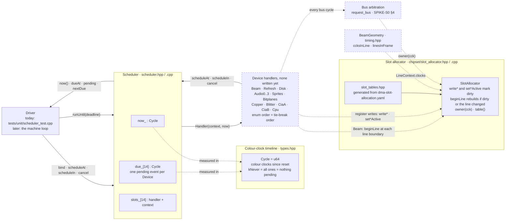
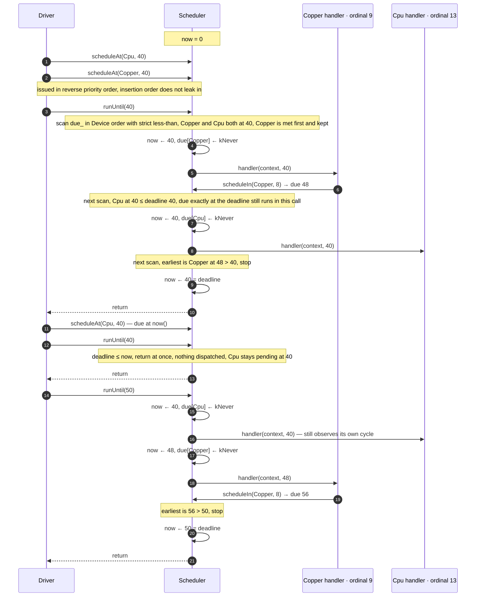
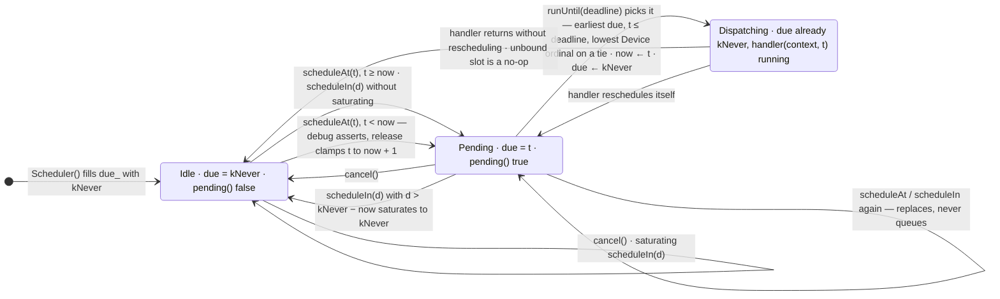

# The core timeline as built: scheduler diagrams

| | |
|---|---|
| **Describes** | `main` from the scheduler merge onward |
| **Derived from** | `src/core/include/meta_amiga/core/scheduler.hpp`, `src/core/scheduler.cpp`, `src/core/include/meta_amiga/core/types.hpp`, `src/core/chipset/slot_allocator.cpp`, `tests/unit/scheduler_test.cpp` |
| **Design** | [SPIKE-S0](../spikes/SPIKE-S0-core-timeline.md) §2–§4 · [ADR-CORE-01](../adr/ADR-CORE-01-cycle-accurate-timing-model.md) D1, D2, D6 |

SPIKE-S0 is the design, written before the code. This page draws what the code on `main`
does, so the two can be compared. Every box and arrow below is taken from the source;
where the spike and the code disagree, the diagram follows the code and the difference is
listed in [§4](#4-where-the-design-documents-and-the-code-differ).

---

## 1. Component view

Solid lines exist in the code today. Dashed boxes and lines are designed in SPIKE-S0 or
ADR-CORE-01 and not yet written.

What the solid part says:

- **The scheduler owns the timeline.** `now_` is the only clock in the core (ADR-CORE-01
  D1). It moves only inside `runUntil`, and nothing else in the core keeps time.
- **One slot per device, not a queue.** `due_` and `slots_` are fixed arrays indexed by
  `Device`. A second `scheduleAt` for the same device replaces the first.
- **Two kinds of caller.** The driver binds handlers, seeds events and advances time with
  `runUntil`. A handler, once dispatched, may call `scheduleAt`, `scheduleIn` or `cancel`
  for itself or for another device. It runs inside the driver's `runUntil` call, at the
  cycle it was due.
- **Today the only driver is the unit test.** No device handler exists on `main`; the
  tests bind small tracing handlers in their place.

What the dashed part says:

- **The allocator is not wired to the scheduler.** It builds and is tested on its own,
  and `beginLine` is called only by its tests. The intended caller is the `Beam` device's
  handler at each line boundary (the `Beam` enumerator's own comment says so), fed the
  line length by `BeamGeometry::ccksInLine`.
- **Nothing consumes `owner(cck)` yet.** The bus arbitration protocol of SPIKE-S0 §4,
  through which every participant asks for a slot (ADR-CORE-01 D2), has no code.

---

## 2. One `runUntil`, with a tie

Two devices, Copper (ordinal 9) and Cpu (ordinal 13), are both due at cycle 40. The
Copper handler reschedules itself 8 cycles on; the Cpu handler does not. The trace was
checked by running exactly these calls against `scheduler.cpp`.

The rules the trace shows, each pinned by a test in `tests/unit/scheduler_test.cpp`:

| Rule | Steps | Test |
|---|---|---|
| Earliest cycle first; on a tie the lower `Device` ordinal, whatever the call order | 1–8 | `tiesBreakByDeviceOrder`, `identicalSchedulesProduceIdenticalTraces` |
| `now()` jumps to each event's cycle, and the handler observes exactly that cycle | 4–5, 7–8, 15–18 | `dispatchesInCycleOrder` |
| A handler's slot is cleared before it is called, so it can reschedule itself | 4–6, 17–19 | `handlersMayRescheduleThemselves` |
| An event due exactly at `deadline` runs in the same call | 7–8 | `eventsBeyondTheDeadlineStayPending` |
| A deadline at or before `now()` dispatches nothing, not even an event due at `now()`; that event runs first on the next call with a later deadline | 11–16 | `aDeadlineAtNowDispatchesNothing` |
| On every call that advances, `now()` ends exactly on `deadline` | 9, 20 | `dispatchesInCycleOrder`, `handlersMayRescheduleThemselves` |

The boundary, stated once: the deadline is **inclusive** for events, and a call whose
deadline does not move time forward is a no-op. An event can only be left waiting at the
current cycle by being scheduled there *after* the call that reached it returned.

---

## 3. One device's event slot

The code stores a single `Cycle` per device, so it has two resting states, not four:
never scheduled, cancelled, dispatched and saturated are all `due = kNever` and are
indistinguishable afterwards.

- **Saturation.** `scheduleIn(d)` computes `now + d` only when it cannot pass `kNever`;
  otherwise it stores `kNever`, which is exactly what `cancel` stores. Without the check
  the sum would wrap into the past, and a release build would clamp it to `now + 1` and
  fire almost at once (`scheduleInSaturatesAtNever`).
- **A past schedule** is drawn from Idle, but the same clamp applies from Pending:
  `scheduleAt` never keeps the old value. Clamping to `now + 1` rather than `now` is what
  keeps `runUntil` advancing (`aPastScheduleAdvancesRatherThanHanging`, release builds
  only).
- **An unbound device** still goes through Dispatching; with no handler the dispatch is a
  no-op and the slot ends Idle (`unboundDevicesDispatchAsNoOps`).

---

## 4. Where the design documents and the code differ

The diagrams follow the code in each case.

1. **`now()` after a past deadline.** SPIKE-S0 §2.3 property 3 and §5 test 10 say `now`
   equals `deadline` on return "in every case". The code, and §5 test 9, return from a
   deadline at or before `now()` without moving `now`, so `now()` then exceeds
   `deadline`. Test 10 holds for every call that advances time.
2. **Slot table shape.** SPIKE-S0 §3.1 sketches `slot_owner[0..226]` holding a `Device` or
   `FREE`. The code's table has 228 entries, for the NTSC long line, and holds a
   `SlotOwner`: a separate enumeration with one owner per sprite and per bitplane and no
   Beam, Copper, Blitter, CIA or CPU entries. No mapping between `SlotOwner` and the
   scheduler's `Device` exists yet; arbitration will need one.
3. **What gates a fixed slot.** The §3.1 `rebuild` sketch places refresh, disk and audio
   unconditionally and gates sprites on `SPREN` and one vertical window. The code places
   only refresh when DMA master is off, needs both the enable and the device's active
   state for disk and each audio channel, and takes a per-sprite window mask from the
   caller.
4. **"The cycle it was scheduled for."** SPIKE-S0 §2.3 property 1 and the `Handler`
   comment say a handler observes the cycle it was scheduled for. That holds for the cycle
   *stored*; after a release-build past schedule the stored cycle is `now + 1`, not the
   one requested.
