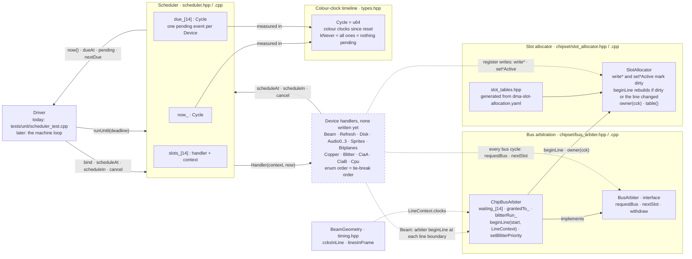
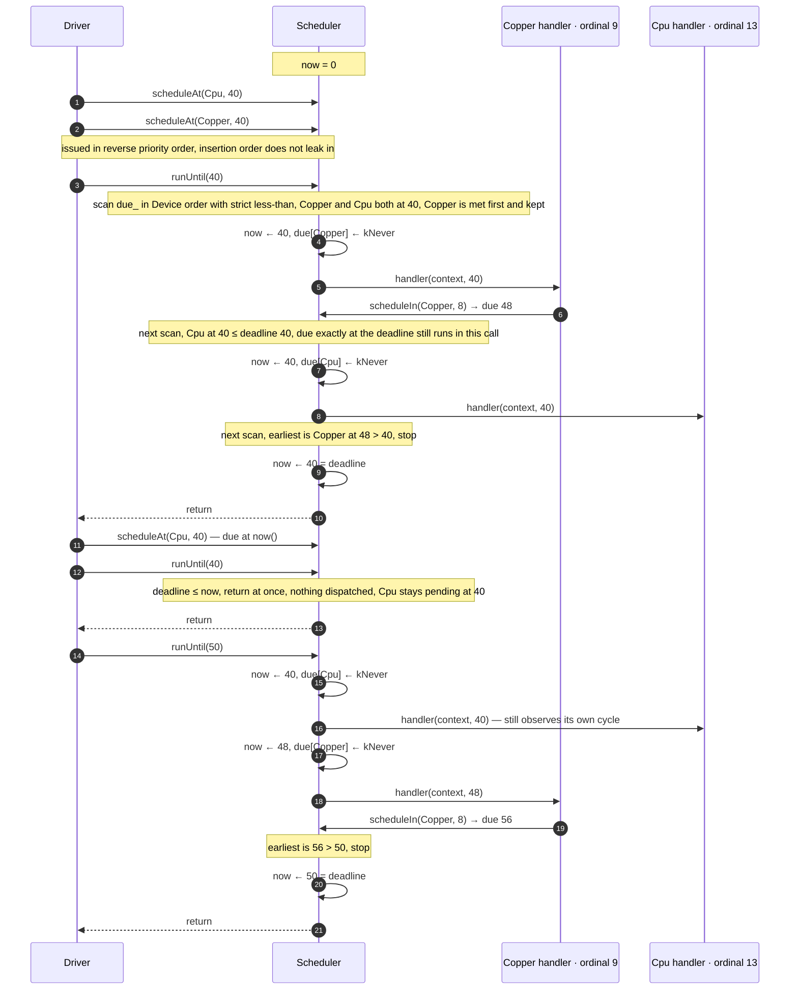
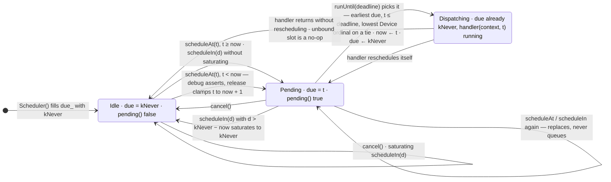
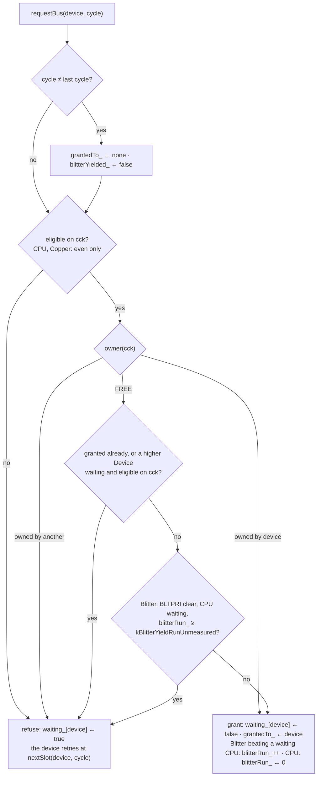
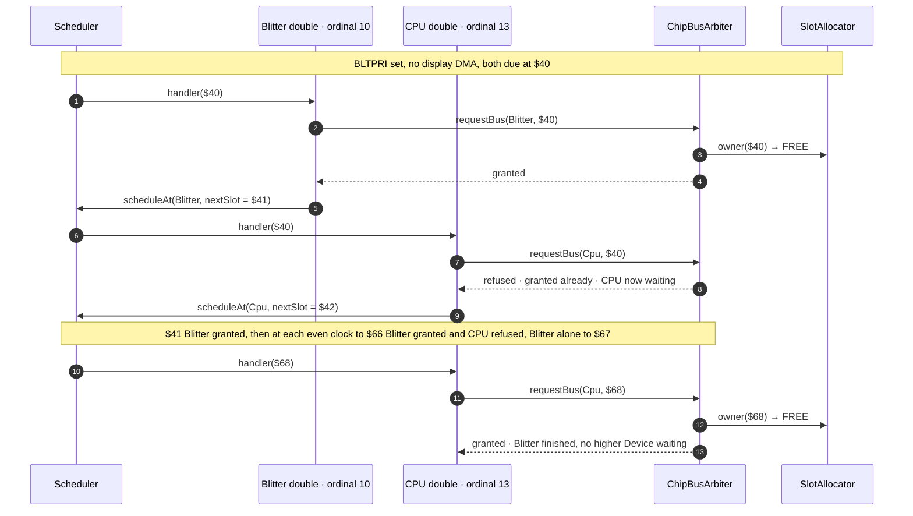

# The core timeline as built: scheduler diagrams

| | |
|---|---|
| **Describes** | `main` from the scheduler merge onward |
| **Derived from** | `src/core/include/meta_amiga/core/scheduler.hpp`, `src/core/scheduler.cpp`, `src/core/include/meta_amiga/core/types.hpp`, `src/core/chipset/slot_allocator.cpp`, `src/core/include/meta_amiga/core/chipset/bus_arbiter.hpp`, `src/core/chipset/bus_arbiter.cpp`, `tests/unit/scheduler_test.cpp`, `tests/unit/bus_arbiter_test.cpp` |
| **Design** | [SPIKE-S0](../spikes/SPIKE-S0-core-timeline.md) §2–§4 · [ADR-CORE-01](../adr/ADR-CORE-01-cycle-accurate-timing-model.md) D1, D2, D6 |

SPIKE-S0 is the design, written before the code. This page draws what the code on `main`
does, so the two can be compared. Every box and arrow below is taken from the source;
where the spike and the code disagree, the diagram follows the code and the difference is
listed in [§4](#4-where-the-design-documents-and-the-code-differ).

---

## 1. Component view

Solid lines exist in the code today. Dashed boxes and lines are designed in SPIKE-S0 or
ADR-CORE-01 and not yet written.

What the solid part says:

- **The scheduler owns the timeline.** `now_` is the only clock in the core (ADR-CORE-01
  D1). It moves only inside `runUntil`, and nothing else in the core keeps time.
- **One slot per device, not a queue.** `due_` and `slots_` are fixed arrays indexed by
  `Device`. A second `scheduleAt` for the same device replaces the first.
- **Two kinds of caller.** The driver binds handlers, seeds events and advances time with
  `runUntil`. A handler, once dispatched, may call `scheduleAt`, `scheduleIn` or `cancel`
  for itself or for another device. It runs inside the driver's `runUntil` call, at the
  cycle it was due.
- **Today the only driver is the unit test.** No device handler exists on `main`; the
  tests bind small tracing handlers in their place.

What the dashed part says:

- **No device drives the arbiter yet.** `ChipBusArbiter::beginLine` rebuilds the slot
  table and is called only by test doubles of the `Beam` device; the intended caller is
  the `Beam` handler at each line boundary, fed the line length by
  `BeamGeometry::ccksInLine`. Likewise only test doubles of the CPU, Blitter and Copper
  call `requestBus`. The arbiter itself is solid: it is the consumer of `owner(cck)`, and
  §5 draws it.

---

## 2. One `runUntil`, with a tie

Two devices, Copper (ordinal 9) and Cpu (ordinal 13), are both due at cycle 40. The
Copper handler reschedules itself 8 cycles on; the Cpu handler does not. The trace was
checked by running exactly these calls against `scheduler.cpp`.

The rules the trace shows, each pinned by a test in `tests/unit/scheduler_test.cpp`:

| Rule | Steps | Test |
|---|---|---|
| Earliest cycle first; on a tie the lower `Device` ordinal, whatever the call order | 1–8 | `tiesBreakByDeviceOrder`, `identicalSchedulesProduceIdenticalTraces` |
| `now()` jumps to each event's cycle, and the handler observes exactly that cycle | 4–5, 7–8, 15–18 | `dispatchesInCycleOrder` |
| A handler's slot is cleared before it is called, so it can reschedule itself | 4–6, 17–19 | `handlersMayRescheduleThemselves` |
| An event due exactly at `deadline` runs in the same call | 7–8 | `eventsBeyondTheDeadlineStayPending` |
| A deadline at or before `now()` dispatches nothing, not even an event due at `now()`; that event runs first on the next call with a later deadline | 11–16 | `aDeadlineAtNowDispatchesNothing` |
| On every call that advances, `now()` ends exactly on `deadline` | 9, 20 | `dispatchesInCycleOrder`, `handlersMayRescheduleThemselves` |

The boundary, stated once: the deadline is **inclusive** for events, and a call whose
deadline does not move time forward is a no-op. An event can only be left waiting at the
current cycle by being scheduled there *after* the call that reached it returned.

---

## 3. One device's event slot

The code stores a single `Cycle` per device, so it has two resting states, not four:
never scheduled, cancelled, dispatched and saturated are all `due = kNever` and are
indistinguishable afterwards.

- **Saturation.** `scheduleIn(d)` computes `now + d` only when it cannot pass `kNever`;
  otherwise it stores `kNever`, which is exactly what `cancel` stores. Without the check
  the sum would wrap into the past, and a release build would clamp it to `now + 1` and
  fire almost at once (`scheduleInSaturatesAtNever`).
- **A past schedule** is drawn from Idle, but the same clamp applies from Pending:
  `scheduleAt` never keeps the old value. Clamping to `now + 1` rather than `now` is what
  keeps `runUntil` advancing (`aPastScheduleAdvancesRatherThanHanging`, release builds
  only).
- **An unbound device** still goes through Dispatching; with no handler the dispatch is a
  no-op and the slot ends Idle (`unboundDevicesDispatchAsNoOps`).

---

## 4. Where the design documents and the code differ

The diagrams follow the code in each case.

1. **`now()` after a past deadline.** SPIKE-S0 §2.3 property 3 and §5 test 10 say `now`
   equals `deadline` on return "in every case". The code, and §5 test 9, return from a
   deadline at or before `now()` without moving `now`, so `now()` then exceeds
   `deadline`. Test 10 holds for every call that advances time.
2. **Slot table shape.** SPIKE-S0 §3.1 sketches `slot_owner[0..226]` holding a `Device` or
   `FREE`. The code's table has 228 entries, for the NTSC long line, and holds a
   `SlotOwner`: a separate enumeration with one owner per sprite and per bitplane and no
   Beam, Copper, Blitter, CIA or CPU entries. `deviceFor` in `bus_arbiter.hpp` maps each
   owner to the scheduler's `Device`, collapsing the eight sprites and six planes.
3. **What gates a fixed slot.** The §3.1 `rebuild` sketch places refresh, disk and audio
   unconditionally and gates sprites on `SPREN` and one vertical window. The code places
   only refresh when DMA master is off, needs both the enable and the device's active
   state for disk and each audio channel, and takes a per-sprite window mask from the
   caller.
4. **"The cycle it was scheduled for."** SPIKE-S0 §2.3 property 1 and the `Handler`
   comment say a handler observes the cycle it was scheduled for. That holds for the cycle
   *stored*; after a release-build past schedule the stored cycle is `now + 1`, not the
   one requested.
5. **Who contends a FREE slot.** SPIKE-S0 §4 grants a FREE slot when "no higher-priority
   device is contending" it without saying what contending is. The code reads it as: a
   device that has already been granted this clock, or one holding a refused request on
   a clock it may fetch on. A refused request stands until it is granted or withdrawn,
   which is what lets a waiting CPU be seen by the Blitter that dispatches before it.
6. **Which slots the CPU may use.** §4 says the CPU "retries on the next slot". The code
   makes that the next *even* clock (`tables::kCpuOwnsParity`, the 68000's half of the bus
   in the manual's Figure 6-10), as it already is for the Copper. Without it the CPU could
   take the odd clocks the fixed slots leave free, and the manual's arithmetic, six lores
   planes halving the CPU's share of the fetch window, would not follow from the table.
   Specification §3's prose says the CPU also "takes odd slots nothing claimed"; the code
   follows the transcribed `cpu_owns_parity: even` instead, and the two need reconciling.
   Parity is taken per line, from the clock within the line; whether the hardware's is per
   line or absolute is not documented, and with an odd line length that is item 7.
7. **The CPU's bus cycle at a line's end.** The arbiter allocates single clocks and does
   not model a bus cycle's length: `nextSlot(Cpu, …)` after the last clock of a line ($E2)
   is the next line's $00. What the tests show at a line's end comes from the CPU *test
   double*, which asks again two clocks after a grant (one bus cycle), lands on the next
   line's odd $01, is refused, and gets $02. That cadence is a property of the CPU, which
   performs its own bus cycles (ADR-CPU-02 D4), and belongs in the CPU model when one
   exists; the arbiter does not reserve $00 for it, and nothing documents that it should.
   `predictedCpuElapsed` in the tests shares the double's cadence assumption, so the hires
   figure of 402 clocks checks the arbiter against the slot table under that assumption,
   not the assumption itself. Both rest on a 227-clock PAL line, which
   `dma-slot-allocation.yaml` leaves unverified (`colour_clocks_pal: null`), although
   `timing.hpp` relies on it. Unmeasured throughout.
8. **BLTPRI clear.** The bounded run after which the Blitter yields is not stated anywhere
   the project may draw on. The code uses `kBlitterYieldRunUnmeasured`, a placeholder of 1
   that says so, chosen as the smallest run that exercises the path so that it cannot read
   as a borrowed figure. §5 test 19 is a skipped test rather than an assertion of it. What
   *is* asserted is the shape: through a long blit the CPU gets in repeatedly, and because
   the run restarts after each CPU grant, every later wait equals the first
   (`bltpriClearYieldsRepeatedlyAtASteadyInterval`).

---

## 5. Bus arbitration

`requestBus(device, cycle)` as `ChipBusArbiter` implements it. Priority is `Device` order;
the arbiter adds no ordering of its own.

A CPU stall, as `aRefusedCpuStallsOnTheTimeline` and `bltpriPutsTheBlitterAheadOfTheCpu`
drive it: the stall is time passing on the scheduler, not a count the CPU keeps.

| Rule | Test |
|---|---|
| Owned slots go to their owner and no one else; refused requests stand | `ownedSlotsGoToTheirOwnerOnly` |
| A FREE slot goes to the highest contender; a standing request contends only clocks its device may use | `aFreeSlotGoesToTheHighestPriorityContender` |
| §5 test 17: a refused CPU retries on its next slot, and the stall is elapsed clocks | `aRefusedCpuStallsOnTheTimeline` |
| §5 test 18: BLTPRI set, the Blitter precedes the CPU | `bltpriPutsTheBlitterAheadOfTheCpu` |
| §5 test 19: BLTPRI clear, the yield bound | skipped: `bus_arbiter_unmeasured_test` |
| BLTPRI clear, bound not asserted: repeated yields, every CPU wait equal to the first because the run restarts after each CPU grant | `bltpriClearYieldsRepeatedlyAtASteadyInterval` |
| §5 test 20, the arbiter's half: once a WAIT's compared position is reached, the Copper is granted the first free even clock at or after it; the Copper takes only free even slots | `copperWaitReleasesAtTheComparedPosition`, `copperTakesOnlyFreeEvenSlots` |
| ADR-CORE-01 D5: the same CPU work takes 80, 158 and 402 clocks under no planes, six lores and four hires planes, as the table predicts given the CPU double's two-clock cadence (item 7) | `cpuTimingEmergesFromTheDisplayMode` |
| SPIKE-S0 §4.1: a second `BusArbiter` runs the same CPU double with no `SlotAllocator` | `anAsynchronousArbiterNeedsNoAllocator` |
| ADR-CORE-01 D6: the same requests give the same grants | `identicalRequestsProduceIdenticalGrants` |
